## Importazione delle librerie necessarie
<span style='color:#4caf50'></span>

In primo luogo, per eseguire il nostro processo di creazione di
strategie di trading, dobbiamo importare le librerie necessarie nel
nostro ambiente. In tutto questo processo, utilizzeremo alcune delle
librerie finanziarie più popolari in R, ovvero Quantmod, TTR e
Performance Analytics. Utilizzando la funzione library in R, possiamo
importare i nostri pacchetti richiesti.


```r
library(quantmod)
```

```
## Caricamento del pacchetto richiesto: xts
```

```
## Caricamento del pacchetto richiesto: zoo
```

```
## 
## Caricamento pacchetto: 'zoo'
```

```
## I seguenti oggetti sono mascherati da 'package:base':
## 
##     as.Date, as.Date.numeric
```

```
## Caricamento del pacchetto richiesto: TTR
```

```
## Registered S3 method overwritten by 'quantmod':
##   method            from
##   as.zoo.data.frame zoo
```

```r
library(TTR)
library(PerformanceAnalytics)
```

```
## 
## Caricamento pacchetto: 'PerformanceAnalytics'
```

```
## Il seguente oggetto è mascherato da 'package:graphics':
## 
##     legend
```


## Passaggio 2: Estrazione dei dati da Yahoo e Plotting di base

Durante tutto il nostro processo, lavoreremo con i dati del prezzo delle
cryptovalute Bitcoin, Ethereum, Binance, Cardano e XRP. Estraiamo i dati
di queste valute da Yahoo in R.


```r
getSymbols("BTC-USD", src = "yahoo", from = "2019-01-01")
```

```
## [1] "BTC-USD"
```

```r
getSymbols("ETH-USD", src = "yahoo", from = "2019-01-01")
```

```
## [1] "ETH-USD"
```

```r
getSymbols("BNB-USD", src = "yahoo", from = "2019-01-01")
```

```
## [1] "BNB-USD"
```

```r
getSymbols("ADA-USD", src = "yahoo", from = "2019-01-01")
```

```
## [1] "ADA-USD"
```

```r
getSymbols("XRP-USD", src = "yahoo", from = "2019-01-01")
```

```
## [1] "XRP-USD"
```

Ora facciamo un po' di visualizzazione dei nostri dati estratti! Il
seguente codice produce un grafico a barre finanziario dei prezzi delle
azioni insieme al volume.


```r
barChart(`BTC-USD`, theme = chartTheme('black'))
```

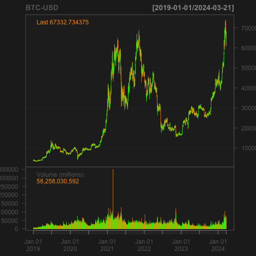

```r
barChart(`BNB-USD`,theme = chartTheme('black'))
```


```r
barChart(`ETH-USD`,theme = chartTheme('black'))
```

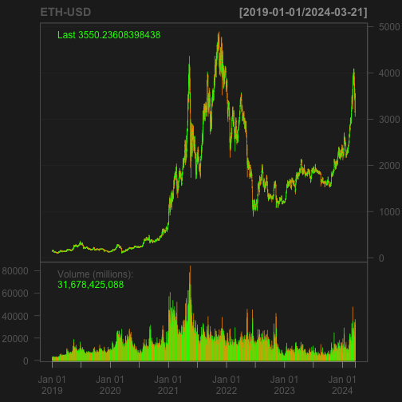

```r
barChart(`ADA-USD`,theme = chartTheme('black'))
```

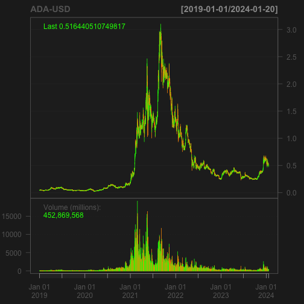

```r
barChart(`XRP-USD`,theme = chartTheme('black'))
```

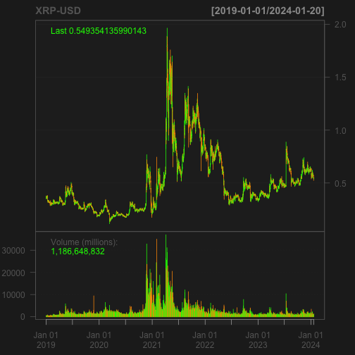

## Creazione di indicatori tecnici

Ci sono molti indicatori tecnici utilizzati per l'analisi finanziaria ma, per la nostra analisi, utilizzeremo e creeremo sei dei più famosi indicatori tecnici, ovvero: Media mobile semplice (SMA), Parabolic Stop And Reverse (SAR), Indice del canale delle materie prime (CCI), Tasso di variazione (ROC), Indice del momento stocastico (SMI) e infine Williams %R. Facciamolo!. Nella nuova dimensione di questi 

### Media mobile semplice (SMA):

L'intervallo di tempo standard che prenderemo è di 20 giorni SMA e 50 giorni SMA. Ma non ci sono restrizioni nell'uso di qualsiasi intervallo di tempo.

Il seguente codice calcolerà la SMA di tre aziende per 20 giorni e 50 giorni insieme ad un grafico:


```r
BTC <- `BTC-USD`
ETH <- `ETH-USD`
BNB <- `BNB-USD`
ADA <- `ADA-USD`
XRP <- `XRP-USD`
```


```r
# 1. BTC-USD
sma50_btc <- SMA(BTC$`BTC-USD.Close`, n = 50)
sma100_btc <- SMA(BTC$`BTC-USD.Close`, n = 100)
lineChart(`BTC-USD`, theme = chartTheme('black'))
```

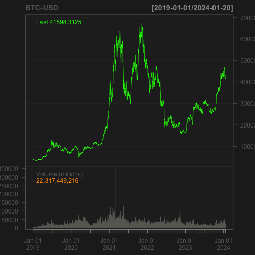

```r
addSMA(n = 50, col = 'blue')
```

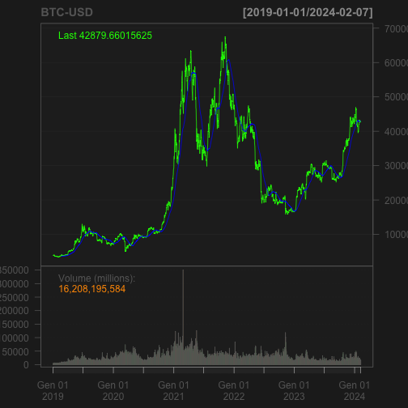

```r
addSMA(n = 100, col = 'orange')
legend('left', col = c('green','blue','orange'),
       legend = c('BTC-USD','SMA50','SMA100'), lty = 1, bty = 'n',
       text.col = 'white', cex = 0.8)
```

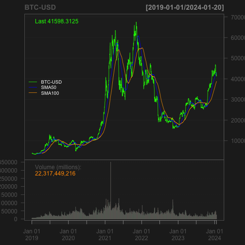


```r
# 2. ETH-USD
sma50_btc <- SMA(ETH$`ETH-USD.Close`, n = 50)
sma100_btc <- SMA(ETH$`ETH-USD.Close`, n = 100)
lineChart(`ETH-USD`, theme = chartTheme('black'))
```


```r
addSMA(n = 50, col = 'blue')
```

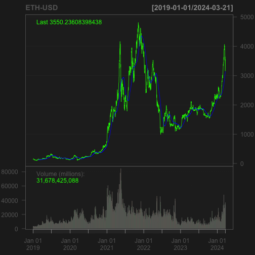

```r
addSMA(n = 100, col = 'orange')
legend('left', col = c('green','blue','orange'),
       legend = c('ETH-USD','SMA50','SMA100'), lty = 1, bty = 'n',
       text.col = 'white', cex = 0.8)
```

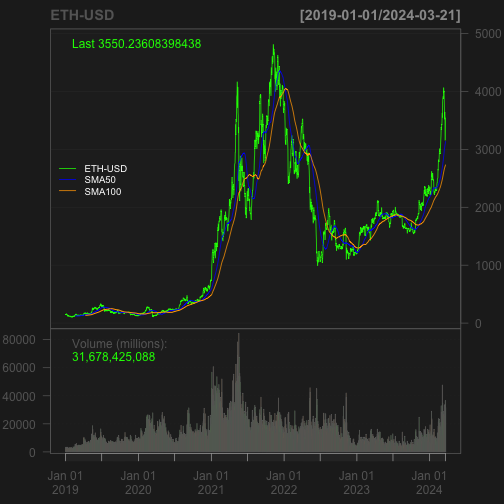


```r
sma50_btc <- SMA(ADA$`ADA-USD.Close`, n = 50)
sma100_btc <- SMA(ADA$`ADA-USD.Close`, n = 100)
lineChart(`ADA-USD`, theme = chartTheme('black'))
```


```r
addSMA(n = 50, col = 'blue')
```

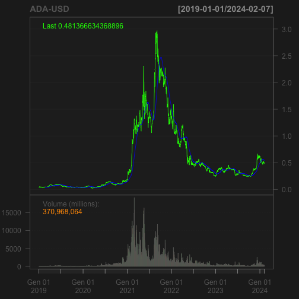

```r
addSMA(n = 100, col = 'orange')
legend('left', col = c('green','blue','orange'),
       legend = c('ADA-USD','SMA50','SMA100'), lty = 1, bty = 'n',
       text.col = 'white', cex = 0.8)
```

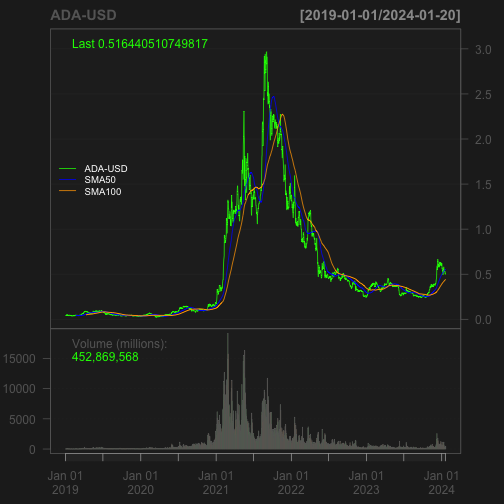


```r
sma50_btc <- SMA(BNB$`BNB-USD.Close`, n = 50)
sma100_btc <- SMA(BNB$`BNB-USD.Close`, n = 100)
lineChart(`BNB-USD`, theme = chartTheme('black'))
```

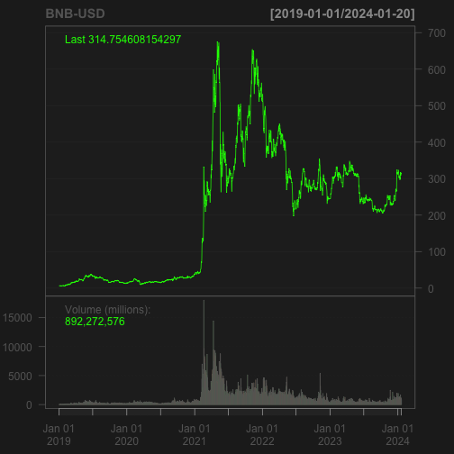

```r
addSMA(n = 50, col = 'blue')
```

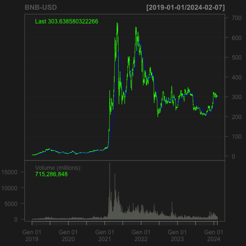

```r
addSMA(n = 100, col = 'orange')
legend('left', col = c('green','blue','orange'),
       legend = c('BNB-USD','SMA50','SMA100'), lty = 1, bty = 'n',
       text.col = 'white', cex = 0.8)
```

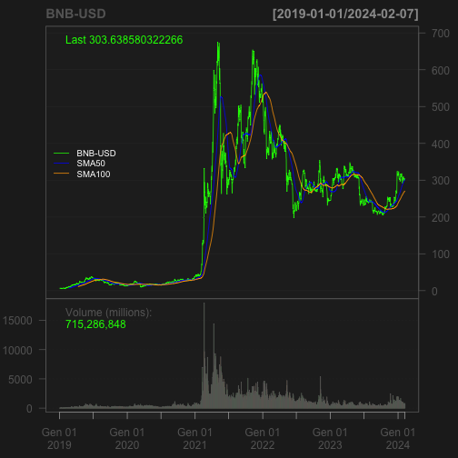


```r
sma50_btc <- SMA(XRP$`XRP-USD.Close`, n = 50)
sma100_btc <- SMA(XRP$`XRP-USD.Close`, n = 100)
lineChart(`XRP-USD`, theme = chartTheme('black'))
```

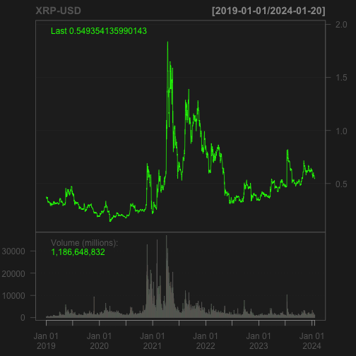

```r
addSMA(n = 50, col = 'blue')
```

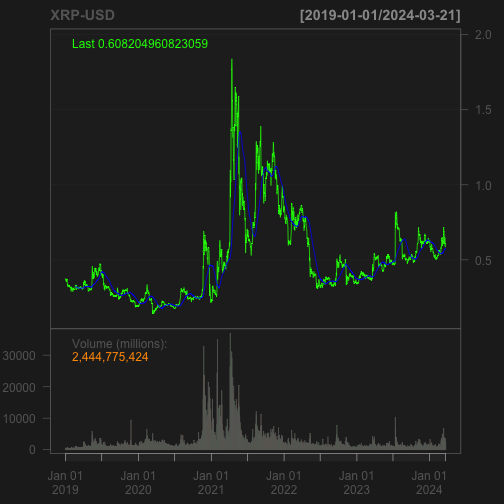

```r
addSMA(n = 100, col = 'orange')
legend('left', col = c('green','blue','orange'),
       legend = c('BNB-USD','SMA50','SMA100'), lty = 1, bty = 'n',
       text.col = 'white', cex = 0.8)
```

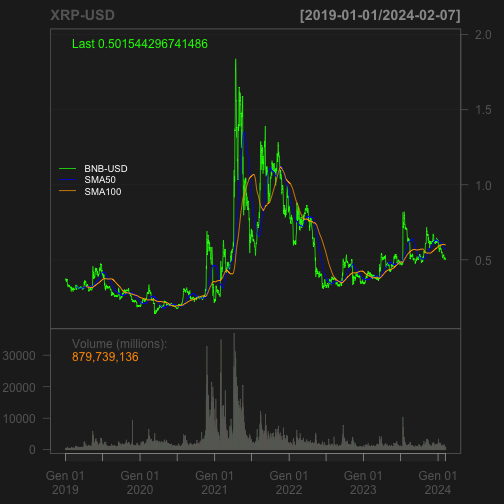

### Indice del Canale delle Materie Prime (CCI):

Per calcolare il CCI, dobbiamo considerare i prezzi giornalieri di massimo, minimo e chiusura delle aziende insieme a un periodo di tempo specificato e un valore costante. In questo passaggio, prenderemo 20 giorni come periodo di tempo e 0,015 come valore costante.

Il seguente codice calcolerà il CCI delle aziende insieme a un grafico:


```r
# 1.BTC 
cci_BTC <- CCI(HLC(BTC), n = 20, c = 0.015)
barChart(BTC, theme = 'black')
```

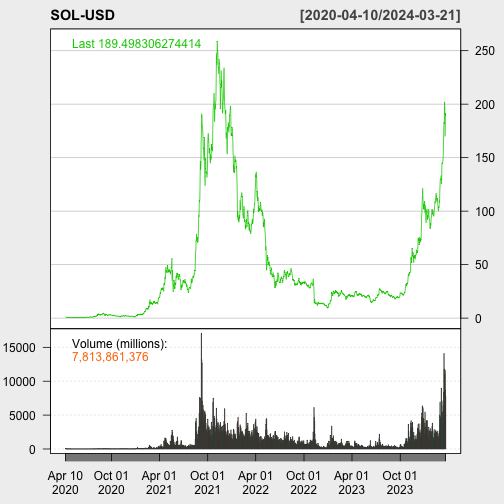

```r
addCCI(n = 20, c = 0.015)
```

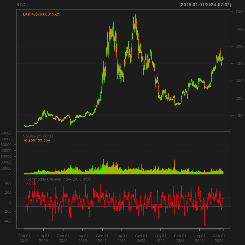

```r
# 2.ETH 
cci_eth <- CCI(HLC(ETH), n = 20, c = 0.015)
barChart(ETH, theme = 'black')
```

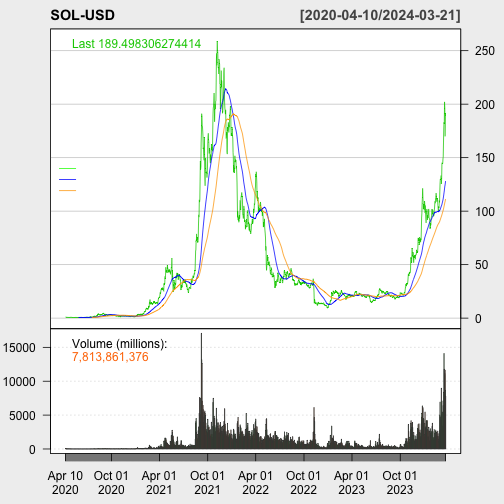

```r
addCCI(n = 20, c = 0.015)
```

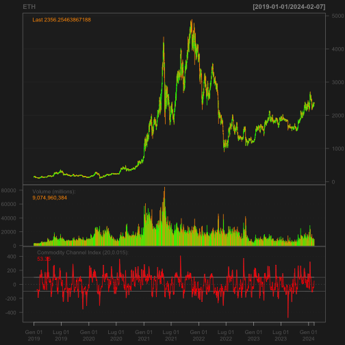

```r
# 3.BNB 
cci_BNB <- CCI(HLC(BNB), n = 20, c = 0.015)
barChart(BNB, theme = 'black')
```

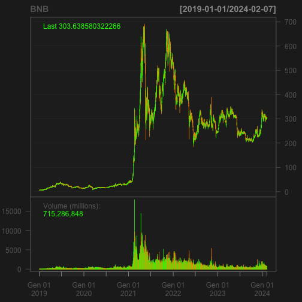

```r
addCCI(n = 20, c = 0.015)
```

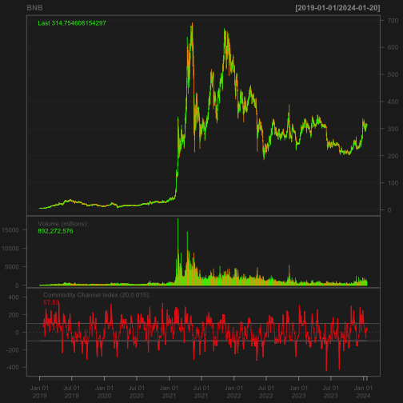

```r
# 4. XRP

cci_XRP <- CCI(HLC(XRP), n = 20, c = 0.015)
barChart(XRP, theme = 'black')
```

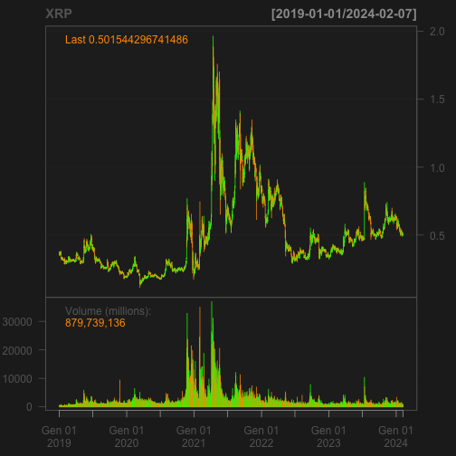

```r
addCCI(n = 20, c = 0.015)
```

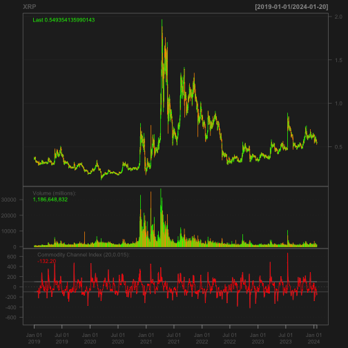

```r
# 5.ADA

cci_ADA <- CCI(HLC(ADA), n = 20, c = 0.015)
barChart(ADA, theme = 'black')
```

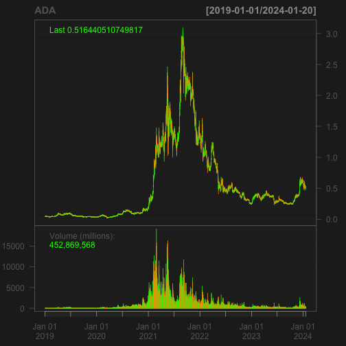

```r
addCCI(n = 20, c = 0.015)
```

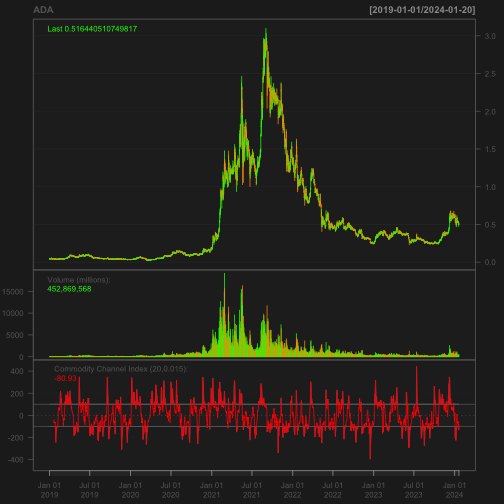

### Tasso di variazione (ROC)

Per calcolare il ROC, dobbiamo considerare un intervallo di tempo specificato e non ci sono restrizioni nell'utilizzare qualsiasi periodo. In questo passaggio, prenderemo 25 giorni come periodo di tempo.

Il codice seguente calcolerà il ROC delle aziende insieme a un grafico:


```r
# 1. BTC
roc_btc <- ROC(BTC$`BTC-USD.Close`, n = 25)
barChart(BTC, theme = 'black')
```

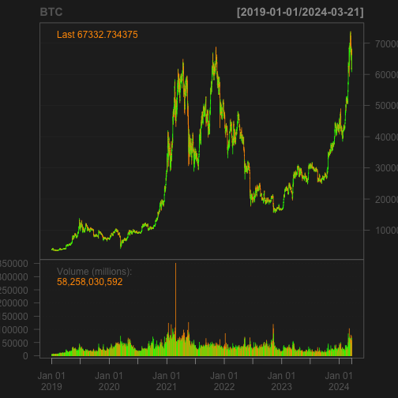

```r
addROC(n = 25)
legend('left', col = 'red', legend = 'ROC(25)', lty = 1, bty = 'n',
       text.col = 'white', cex = 0.8)
```

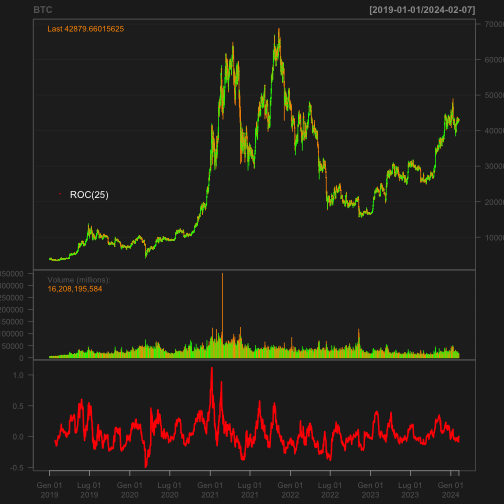

```r
roc_ETH <- ROC(ETH$`ETH-USD.Close`, n = 25)
barChart(ETH, theme = 'black')
```

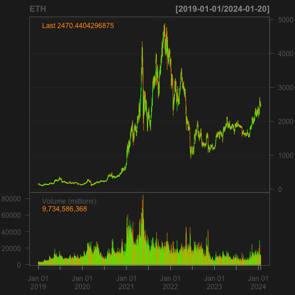

```r
addROC(n = 25)
legend('left', col = 'red', legend = 'ROC(25)', lty = 1, bty = 'n',
       text.col = 'white', cex = 0.8)
```

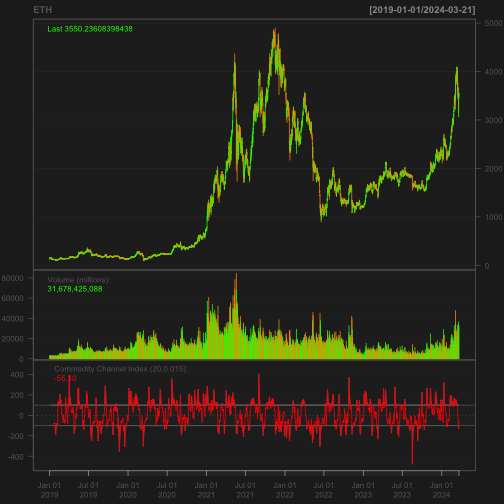

```r
roc_BNB <- ROC(BNB$`BNB-USD.Close`, n = 25)
barChart(BNB, theme = 'black')
```

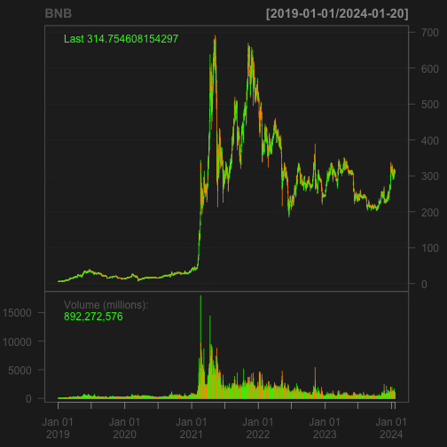

```r
addROC(n = 25)
legend('left', col = 'red', legend = 'ROC(25)', lty = 1, bty = 'n',
       text.col = 'white', cex = 0.8)
```

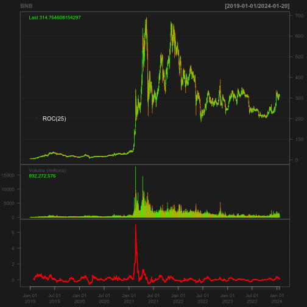

```r
roc_XRP <- ROC(XRP$`XRP-USD.Close`, n = 25)
barChart(XRP, theme = 'black')
```


```r
addROC(n = 25)
legend('left', col = 'red', legend = 'ROC(25)', lty = 1, bty = 'n',
       text.col = 'white', cex = 0.8)
```

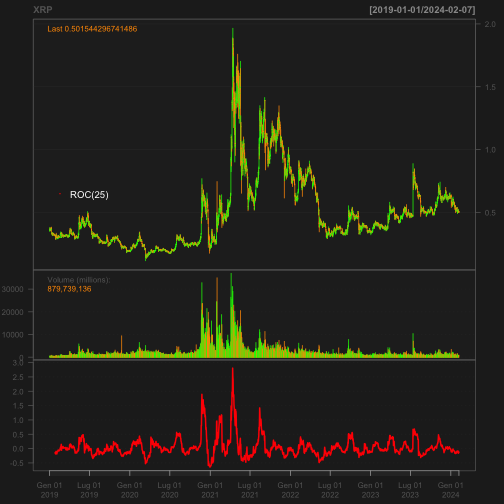

```r
roc_ADA <- ROC(ADA$`ADA-USD.Close`, n = 25)
barChart(ADA, theme = 'black')
```

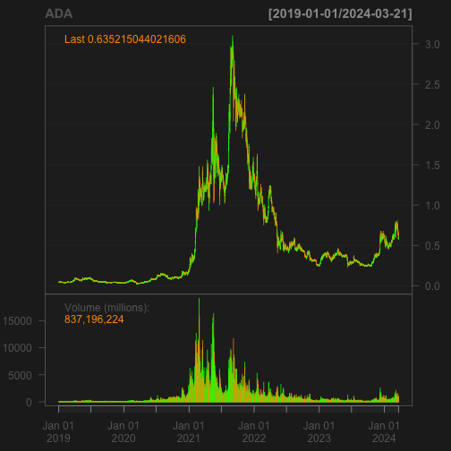

```r
addROC(n = 25)
legend('left', col = 'red', legend = 'ROC(25)', lty = 1, bty = 'n',
       text.col = 'white', cex = 0.8)
```

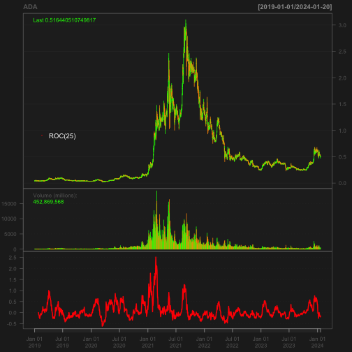


